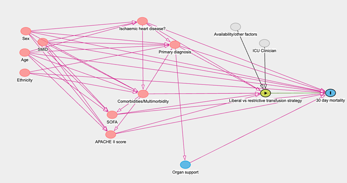

# Work Package 4 – Target trial emulation: Haemoglobin transfusion threshold in critically ill patients with cardiovascular disease (CVD)   

**Leads:** Sinziana Radulescu

**Additional:** Craig Nicolson, Rosalyn Pearson, Steph Burns, Mohammad Kouli, Stella Prizeman-Green, Annemarie Docherty

## Aims and objectives 
Using observational data, we will aim to explore the causal effect of choosing a liberal (transfusion if the haemoglobin level is below 90 g/L) vs restrictive transfusion strategy (transfusion if the haemoglobin level is below 70 g/L) in critically ill patients with cardiovascular disease on ICU outcomes. 

## Methods

### Design
Cohort study

### Study population, setting
All adults admitted to critical care as per overall application. 
We will also undertake this analysis in parallel within populations within Greater Glasgow and Clyde and Aberdeen safe haven environments.

### Variables

#### Outcomes
##### Primary:
* 30-day mortality
##### Other outcomes: 
* Mortality: ICU, hospital, 90 day, 1 year, 5 year; (WW, SMR01, NRS deaths)
* Hospital readmission: 30d, 90d, 1 year, 5 year. (SMR01)
* Complications: e.g. cardiovascular outcomes (ICCA, SMR01, primary care, NRS deaths, Trak labs)

#### Other variables  
##### Predisposing factors: 
age, ethnicity, sex, socioeconomic status (Scottish Index of Multiple Deprivation), comorbidities increasing risk of cardiovascular disease (e.g. hypertension, diabetes), multimorbidity (as identified in WP0), frailty (electronic Frailty index), prior hospital admissions (number of prior admissions with cardiovascular diagnoses, number of prior emergency admissions).   
 
##### Precipitating factors: 
diagnosis on admission to hospital, diagnosis on admission to critical care, admission type (emergency vs planed), severity of illness on admission.  
 
##### Treatment factors: 
transfusions (treated as exposure of interest in causal model), lab results (e.g. haemoglobin), daily organ support, medications (infusions), physiological variables (e.g. heart rate), complications (e.g. new infection), cardiac events (e.g. new arrhythmia).  
 
### Data sources  
The specific data sources are detailed in Table 1 of the overall application (found at the end of section D) and in the Data Selection Form.

### Analysis
We will examine baseline characteristics and summarise these as follows: mean and standard deviation (SD) ore median (interquartile range) will be provided for continuous variables, and count (n) and percentage (%) for categorical variables. We will explore variation of transfusion practice within subgroups of critical patients. 

To examine differences between multimorbidity and health outcomes, ANOVA/Kruskall-Wallis will be used for continuous variables and chi-squared will be used for categorical variables. 

A target trial emulation protocol has been created according to the framework described by Hernan and Robin Am J Epidemiol;183(8):758–764 (2016) – see table 1. 

Directed acyclic graphs have developed to represent the underlying causal structure between the exposure of interest (transfusion thresholds) and the outcome alongside potential confounders and mediators (see picture 1). Estimates of the average treatment effect at admission will be made using inverse probability weighting. This baseline model will then be compared to one incorporating time-varying confounders of treatments across the patient stay, using the parametric g-formula or marginal structural models (dependent on the distribution of the data) for effect estimation. 

We will also undertake this analysis within populations within Greater Glasgow and Clyde and Aberdeen safe haven environments to ensure an adequate sample size (see table 1).

#### Missing data
Missing data will be evaluated and multiple imputation of all missing data using chained equations will be performed if appropriate. 

#### Bias 
The impact of selection bias, underrepresented patient groups and unobserved confounding (in the causal inference context) will be assessed quantitatively, alongside qualitative evaluation of bias not fully measurable through quantitative means.  

## Tables and Figures 
### Table 1: Target trial protocol framework 

|Component	| Target Trial	| Emulated trial using real-world data |
|--|--|--|
|Aim	|To compare patient outcomes of restrictive versus liberal blood transfusion strategies in ICU patients with cardiovascular disease (adults) | Same |
Eligibility | Adults in ICU; Hb value of ≤ 90g/L at the time of inclusion/assessment   | Same |
Treatment strategies |	1.	Single- unit RBC transfusions with a transfusion trigger of less than or equal to 70g/L and a target Hb concentration of 71–90g/L during the intervention period; 2.	Single-unit RBC transfusions with a transfusion trigger of less than or equal to 90 g/L and a target of 91– 110 g/L during intervention.  | Same |
Sample size calculation | 4938 patients divided between 2 groups: liberal (transfusion if the haemoglobin level is below 90 g/L) vs restrictive transfusion strategy (transfusion if the haemoglobin level is below 70 g/L)\* |All patients that meet the inclusion criteria |
Treatment assignment | Liberal versus restrictive transfusion strategy is assigned to participants at random | Liberal versus restrictive transfusion strategy is assigned to participants based on clinician preference/clinical indication |
Follow-up |Follow-up starts at time of randomisation and ends 60 days later, at death, or at loss to follow-up, whichever occurs first. | Same  |
Outcome	| Primary outcome: 30-day mortality | Same |
| Causal contrast | Intention to treat (ITT) effect: the effect of restrictive vs. liberal transfusion strategy. Per-protocol effect: the effect of receiving a liberal vs. restrictive transfusion strategy. |Same |
Statistical analysis |ITT analysis: Comparison of mortality at 30 days between individuals for whom a liberal transfusion strategy was used vs. individuals for whom restrictive transfusion strategy was used. Per-protocol analysis: Comparison of mortality at 30 days between individuals receiving restrictive vs liberal TS, adjusted for baseline age, gender, IHD, APACHE II score, and total non-neurologic SOFA. |ITT analysis: we will check for balance on key variables and adjust for confounders (see variables in red in figure 1).  Per-protocol analysis: patients will be censored at the time they deviate from their assigned strategy. To adjust for the potential selection bias induced by censoring, inverse probability weighting will be used. The weights will be a function of the baseline and post-baseline (time-varying) confounders. Both analyses may require further adjustment for selection bias due to loss to follow-up. |

\*Although there are no publications showing a statistically significant difference in mortality with transfusion strategies in ICU patients with cardiovascular disease, we assume a mortality risk in the control arm of 0.15. In order to detect a relative risk of 1.2, 4938 patients divided into 2 groups will be required. (https://sample-size.net/sample-size-proportions/)  

### Figure 1. Directed acyclic graph (DAG) 
showing the causal relationship between the transfusion strategy choice (liberal vs restrictive) and ICU mortality. The variables in red are confounders (ancestors of exposure and outcome) and represent the minimally sufficient adjustment set. The variable in green represents the exposure. The variables in relationship to organ support are considered mediators. The variables in grey are unobserved (latent) variables and possible instruments. The outcome is 30-day mortality. 

